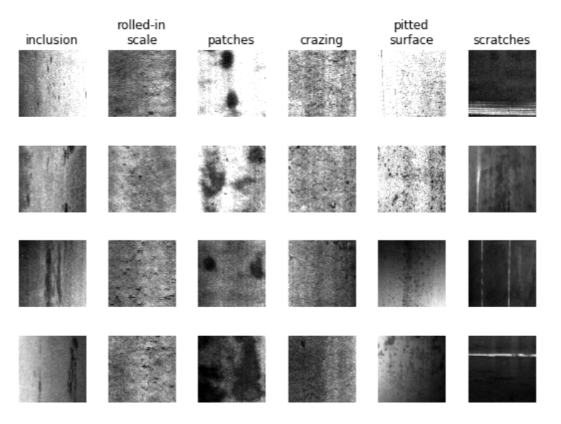

# NEU-Cluster
## Introduction

Classification of the North Eastern University (NEU) Steel Surface Defects Database with transfer 
learning and K-Means clustering. There are two main goals of this project. First, to provide step-by-step 
examples to materials scientists so that this type of analysis can be used for those without a strong 
background in coding/data science. Second, to provide a sensitivity analysis of the steps used in the 
process to provide some intuition on how each step in the process affects the overall results.

A description of the methods used can be found in the paper for this project [1]. The repository focusus more on p
roviding practical examples to follow and implementations of the methods described in the paper.

## The dataset

The NEU database provides images of 6 common defect types on hot-rolled steel sheets. Some examples are provided below:



The NEU dataset [2] has been open-sourced and is available here: 
<http://faculty.neu.edu.cn/yunhyan/NEU_surface_defect_database.html>. The link sometimes goes down, see below.

Update: It looks like the NEU-Detection dataset is available on kaggle here: <https://www.kaggle.com/kaustubhdikshit/neu-surface-defect-database>.
This dataset contains the same images, but is divided into train/validation sets, and contains annotations for localizing the images. This project does not cover detection, but the dataset is still of interest to some. For unsupervised classification (ie this project): Move ALL images (including training and validation for all 6 classes, 1800 total) into a single folder. The annotation files are not needed.

If both of these links are broken, feel free to reach out and I will find a way to get the data to you.

## The project
The main workflow is contained in the notebooks folder. The notebooks are numbered in order, starting with pre-processing, 
and finishing with the generalized model. Simply run the notebooks in order to go through the whole process. Note that 
for several computations which take a long time, I have provided pre-computed results in the .neu_cache folder. 
These results are used in the code blocks that contain the following statement:
```python
use_cache=True
```
If you 
would like to run the computations for yourself, simply set 
```python 
use_cache=False
```
in the corresponding cell in the notebook. Note that this will overwrite the value in the cache after it is run.
 Feel free to play with the settings and see what happens!

## Installation
  1) Download the NEU dataset
  2) Clone the git repository ```git clone https://github.com/rccohn/NEU-Cluster.git```
  3) Move the images in the NEU dataset to data/NEU-CLS/
  4) In the top level directory, (NEU-Cluster), set up a python virtual environment ```python3 -m venv myEnv```
  5) Activate the environment ```source myEnv/bin/activate```
  6) Install required packages ```pip install -r requirements.txt```

## Running the notebooks
Everything can be done through jupyter. With the environment activated, run ```jupyter lab``` to open Jupyter in your
browser. You can now access and run the notebooks!

## Citing this work
If you found this helpful in your own work, pleace cite our [publication](https://doi.org/10.1007/s40192-021-00205-8)!
```
@article{Cohn2021,
   author = {Ryan Cohn and Elizabeth Holm},
   doi = {10.1007/s40192-021-00205-8},
   issue = {2},
   journal = {Integrating Materials and Manufacturing Innovation},
   pages = {231-244},
   title = {Unsupervised Machine Learning Via Transfer Learning and k-Means Clustering to Classify Materials Image Data},
   volume = {10},
   url = {https://doi.org/10.1007/s40192-021-00205-8},
   year = {2021},
}

```


## References
1)  Ryan Cohn and Elizabeth Holm, Unsupervised machine learning via transfer 
learning and k-means clustering to classify materials image data, Integrating Materials and Manufacturing Innovation, 10, 2021
DOI: <https://doi.org/10.1007/s40192-021-00205-8>
ArXiv: <http://arxiv.org/abs/2007.08361>

2) Kechen Song and Yunhui Yan. “A noise robust method based on completed local binary patternsfor hot-rolled steel 
strip surface defects”. In:Applied Surface Science285 (Nov. 2013), pp 858-864.
